# MISIS Git Tutorial

## Установка и настройка Git

**Шаг 1.** Скачиваем и устанавливаем [cmder](https://cmder.net/), версию Full, включающую в себя клиент Git для Windows.

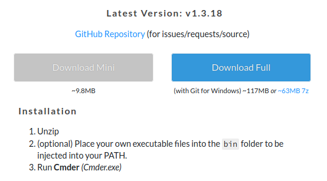

**Шаг 2.** Создаем аккаунт на [GitHub](https://github.com/).

**Шаг 3.** Запускаем `cmder`.

Сгенерируем [SSH-ключ](https://ru.wikipedia.org/wiki/SSH) командой:

```bash
ssh-keygen -b 4096 -C konstantin@example.com
```

В ходе выполнения вас попросят указать путь для сохранения файла (по умолчанию `C:\Users\YOURNAME\.ssh` - нажать Enter), затем - пароль и подтверждение пароля. Пароль не обязательно должен совпадать с паролем Git, можно указать любой. Он будет использоваться в дальнейшем при выполнении push на GitHub.

**Важно знать!** Вы генерируете два файла ключа - приватный (`id_rsa`) и публичный (`id_rsa.pub`). *Никогда не передавайте никому приватный файл `id_rsa`.*

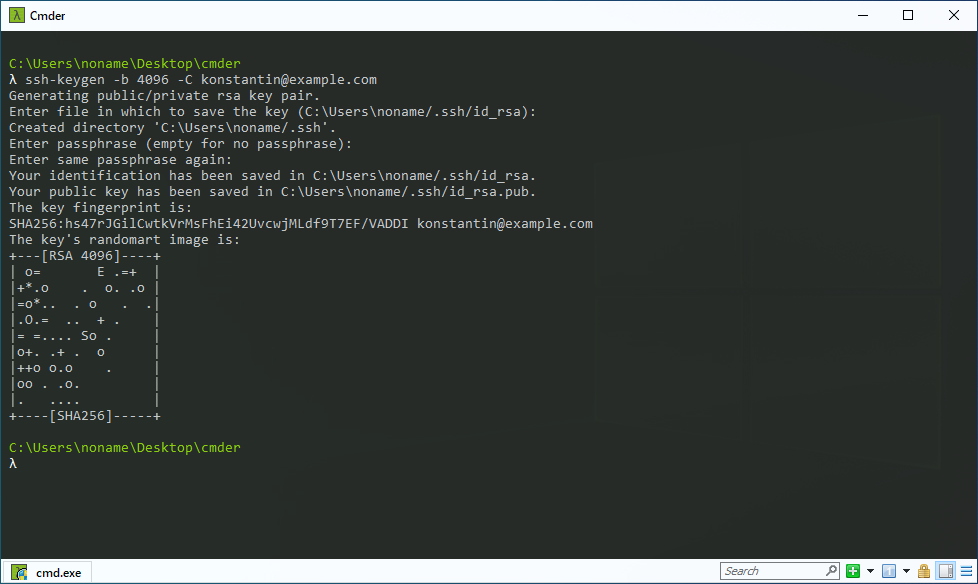

Выведем ваш публичный ключ командой `cat C:\Users\YOURNAME\.ssh\id_rsa.pub`:

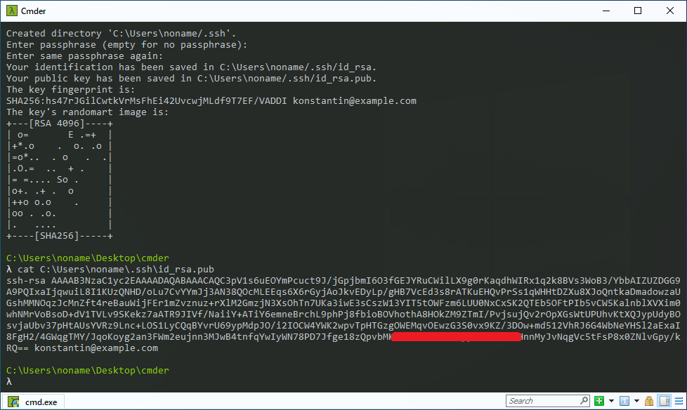

Затем, перейдем в настройки [SSH and GPG Keys](https://github.com/settings/keys) GitHub и добавим выведенный SSH-ключ, нажав на кнопку New SSH Key. В открывшееся окно вводим любое название ключа и копируем ключ из cmder:

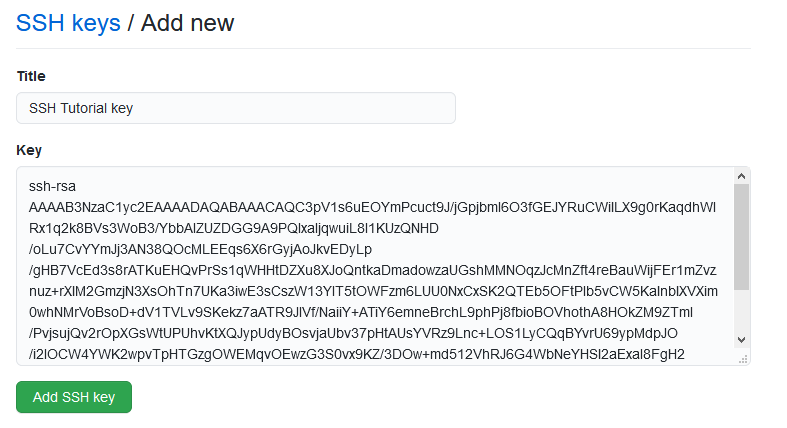

---

**Шаг 4.** Заходим на страницу проекта [https://github.com/Kinetikm/misis_ida](https://github.com/Kinetikm/misis_ida), в правом верхнем углу жмем "Fork".

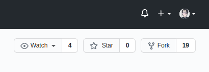

Среди ваших проектов появится проект misis_ida с пометкой, что это форк другого репозитория.

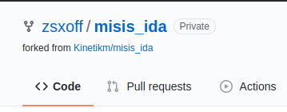

Жмем кнопку Code, выбираем Clone > SSH, копируем адрес из окошка.

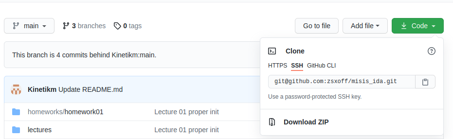

Переходим в cmder, перемещаемся в ваш каталог с проектами, например, командой `cd C:\Projects\Python`. Подойдет любой каталог, но лучше выбрать тот, в котором вы храните проекты, так как именно в него будет клонирован репозиторий с GitHub.

Вводим команду `git clone git@github.com:НИКНЕЙМ/misis_ida.git` или просто `git clone скопированный_адрес`.

При первом клонировании вас спросят, хотите ли вы продолжить подключение, пишем `yes` и жмем Enter. Затем вводим ваш пароль от SSH с шага 3.

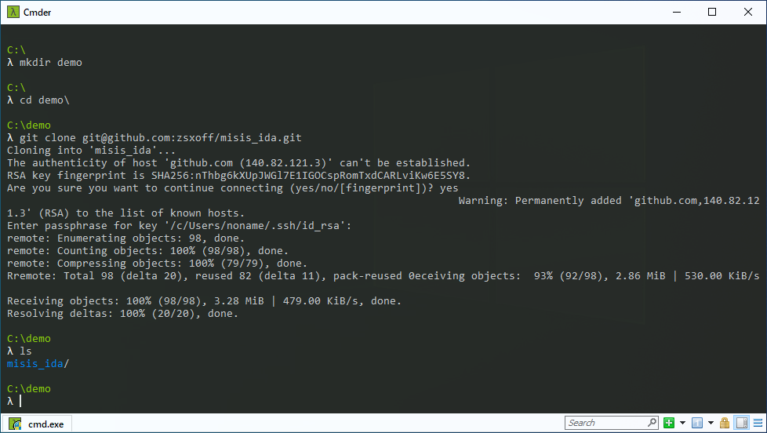

Вы великолепны! Выполните команду `cd .\misis_ida\` для перехода в каталог проекта и переходите к следующему шагу.

## Работа в проекте

После того как вы клонировали проект себе на компьютер, необходимо выполнить некоторые действия по его настройке.

**Шаг 1.** Добавьте исходный репозиторий в upstream:

```bash
git remote add upstream git@github.com:Kinetikm/misis_ida.git
```

Затем, выполните команду `git fetch upstream` чтобы добавить ветки оригинального репозитория.

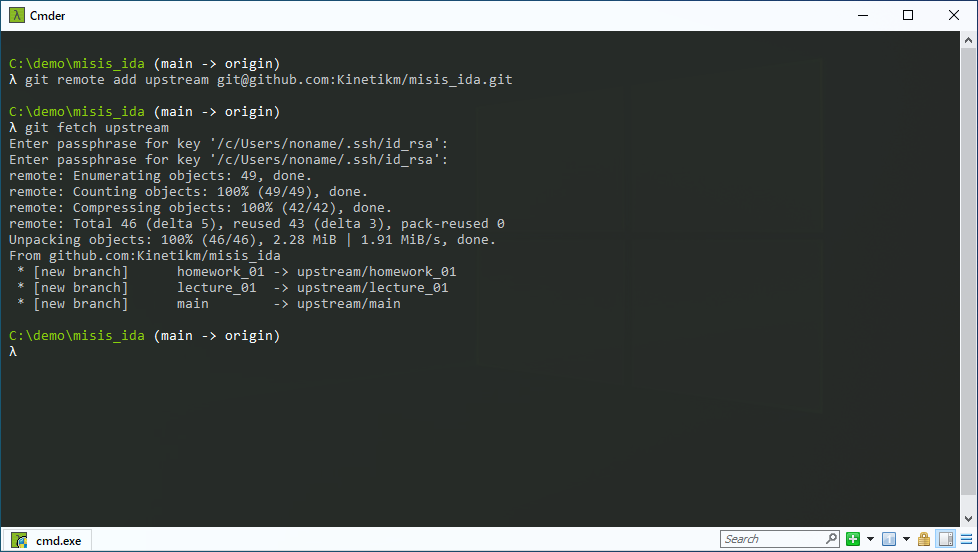

**Шаг 2.** Выполните переключение на нужную для работы ветку, например, на ветку домашней работы `homework_01`. Это можно сделать командой

```bash
git checkout -b homework_01 upstream/homework_01
```

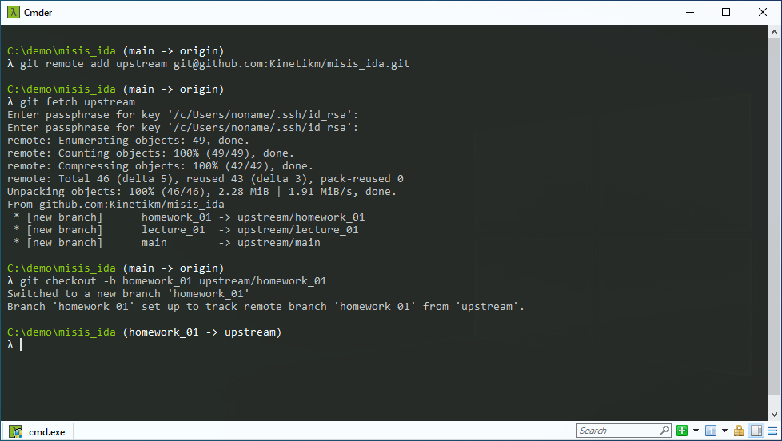

Отлично! Теперь вы можете вносить изменения в нужной вам ветке, например, выполнять д/з в файлах Jupyter Notebook.

Измените какой-нибудь файл, например, сделайте д/з за понедельник.

Теперь перейдите в cmder и выполните команду `git status`. Вы увидите, какие файлы в проекте были изменены вами.

Если имена файлов отображаются как странные символы вместо русских букв, выполните команду:

```bash
git config --global core.quotePath false
```

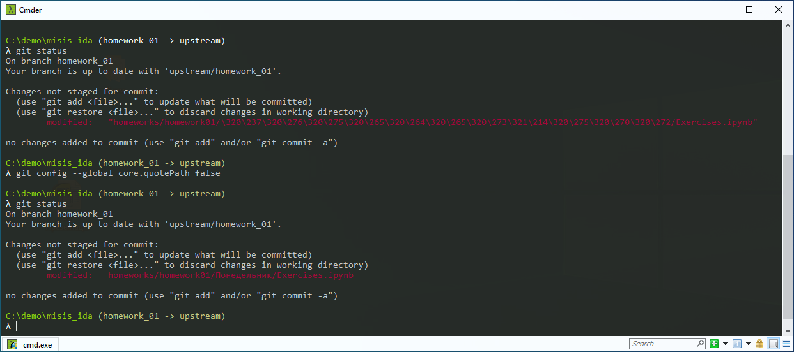

**Шаг 3.** Для того чтобы загрузить изменения, которые вы внесли в ветке, необходимо сначала внести измененные файлы в коммит, а затем описать, что было сделано в коммите. Самым простым способом добавить все ваши изменения является команда, которая добавит все измененые файлы:

```bash
git add *
```

Если вы хотите добавить только некоторые измененные файлы, перечислите их после команды `git add`, например:

```bash
git add homeworks/homework01/Понедельник/Exercises.ipynb
```

Выполните команду `git status` еще раз, вы увидите, как ваши файлы перешли из статуса "not staged" в статус "to be commited".

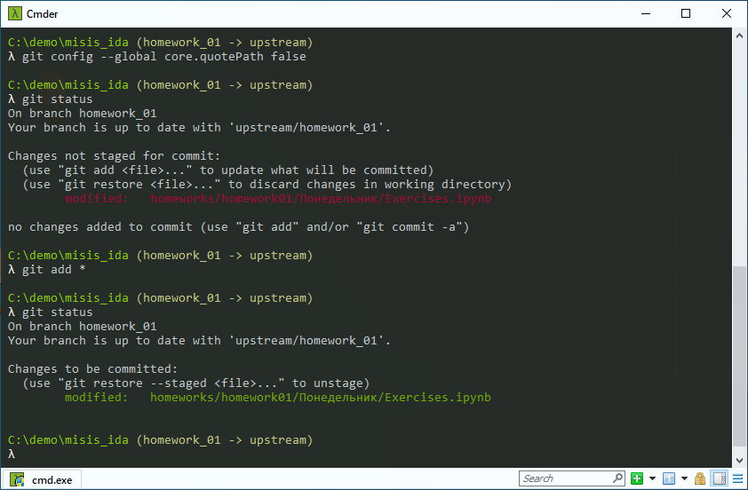

Перед тем, как отправить файлы в историю изменений и сделать коммит, вам необходимо дать ему текстовое описание, например, что было сделано в данном изменении. Вы можете добавить описание командой:

```bash
git commit -m "homework_01 Сделан понедельник"
```

Указание названия ветки перед текстом коммита является хорошим тоном и интегрируется с системами отслеживания задач вроде Jira, советую следовать такому принципу, но это не обязательно.

Вероятнее всего, при первом коммите вы столкнетесь с проблемой отсутствия ваших имени и почты в настройках Git. Для этого можете выполнить команды:

```bash
git config --local user.name "ваш_никнейм"
git config --local user.email konstantin@example.com
```

Вместо никнейма вы можете использовать ваше имя, тогда в коммитах будет указано ваше имя.

После этого, повторить команду коммита еще раз (`git commit -m "homework_01 Сделан понедельник"`).

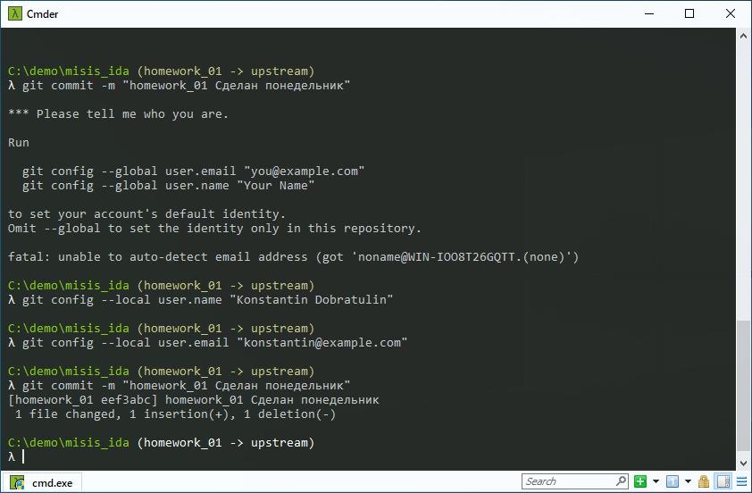

*Совет:* Команда `git log` покажет вам историю изменений в данной ветке. Для выхода из просмотра истории нажмите на клавиатуре `q`.

Продолжайте выполнять задания, добавлять файлы и делать коммиты. Вы можете сделать все задания за один раз и добавить их одним коммитом. В данном случае это не страшно, но на практике атомарность коммитов приветствуется (прим. сделано задание 1 -> коммит, сделано задание 2 -> коммит, сделано задание 3 -> коммит и т.д.).

**Шаг 4.** После того как вы закончили делать изменения в локальной ветке (то есть ветке на вашем компьютере), необходимо отправить ее на GitHub.

По умолчанию удаленная ветка носит название `origin`, вы можете посмотреть ее адрес выполнив команду `git remote get-url origin` и убедиться, что ее адрес совпадает с адресов вашего проекта-форка оригинального репозитория.

Далее, необходимо выполнить команду загрузки изменений на удаленную ветку (и ввести пароль от SSH):

```bash
git push -u origin homework_01
```

Данная команда загрузит по адресу `origin` локальную ветку с названием `homework_01`, в которой вы делали изменения и коммиты.

Вы можете убедиться в корректности загрузки, перейдя на страницу своего проекта и выбрав ветку "homework_01".

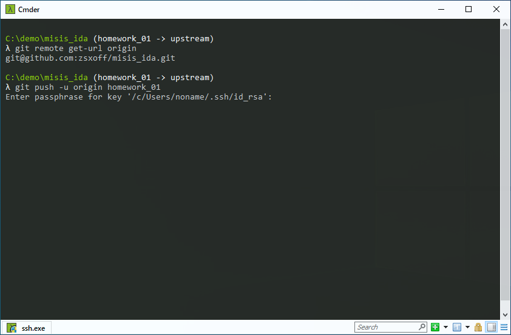
